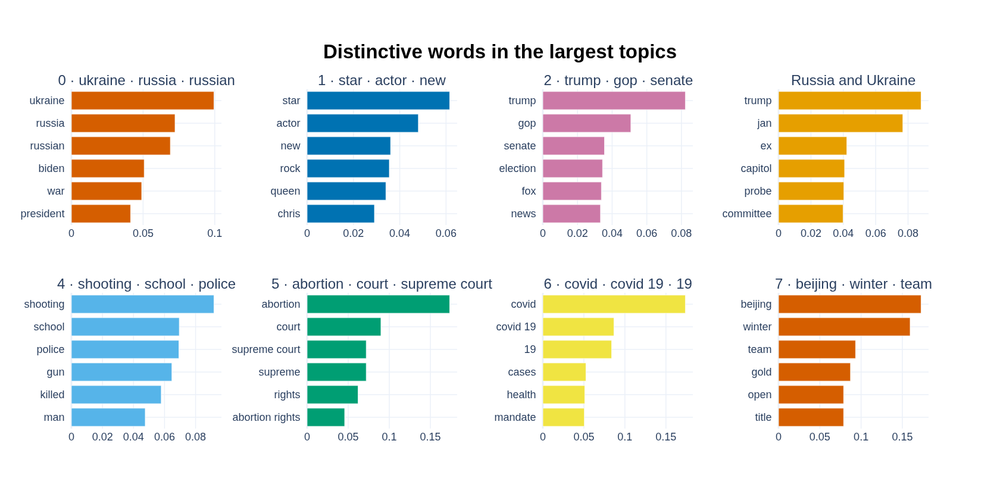
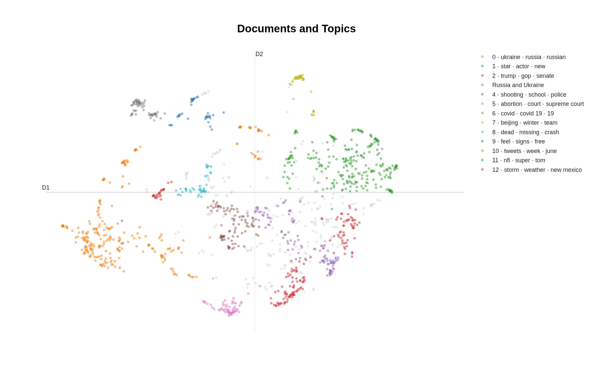
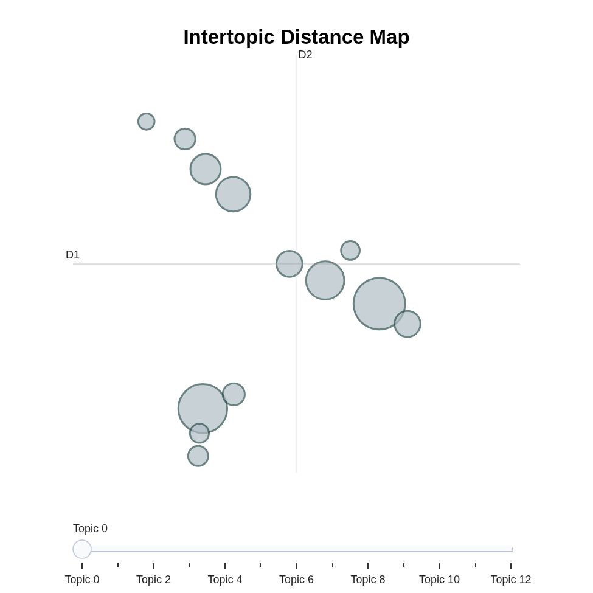
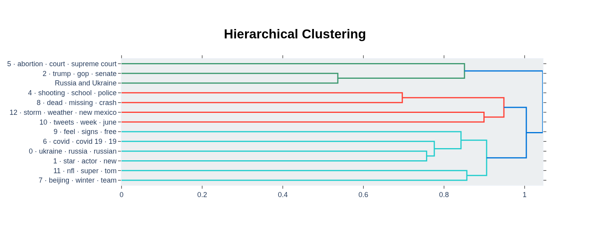

# DSA 495 — Module 06: Topic Modeling Playground

This is a runnable copy of Module 06 for experimenting with **BERTopic**, **UMAP**, **HDBSCAN**, c-TF-IDF, and topic visualization using **1,398 HuffPost articles from 2022**.

## Open in Google Colab

[Open the notebook in Google Colab](https://colab.research.google.com/github/StrokeOfLuck/-DSA495-TextAnalysis-06/blob/main/DSA495-M06-Topic-Modeling.ipynb)

The notebook loads `data/news_category_2022.csv` directly from this repository. Topic 3 has been given the human-readable label **Russia and Ukraine** after reviewing the topic words. That label does **not** change the clustering; it only changes the displayed name.

# Visual study guide

The pictures below are generated from the **actual notebook run**, using the same 1,398 articles and model settings as the class exercise.

## 1. Topic Word Bars

**What am I looking at?**  
Each small chart is one topic. The bars are the words or short phrases that are especially distinctive for that topic. Longer bars mean a higher **c-TF-IDF** score.

**Why is this useful to me?**  
This is the easiest way to figure out **what a topic is actually about**. I can look at the strongest words, propose a plain-English topic name, and then check real articles to see whether my interpretation holds up.

**Simple question to ask:** *What words make this group different from the other groups?*

[Open the interactive version](generated/01-topic-word-bars.html)

## 2. Document Map

**What am I looking at?**  
Every dot is one article. Articles with similar language and meaning tend to appear near one another. The colors show the topic assignments.

**Why is this useful to me?**  
It lets me see **how the individual articles group together**. Tight blobs suggest clear groups. Overlapping groups can show related subjects or fuzzy boundaries. A dot sitting away from its group may be worth reading because it could be unusual or weakly classified.

The X and Y axes do not have normal meanings like “more political” or “less political.” They are coordinates created by UMAP to make the high-dimensional text relationships visible in two dimensions.

**Simple question to ask:** *Which articles naturally hang out together?*

[Open the interactive version](generated/02-document-map.html)

## 3. Intertopic Distance Map

**What am I looking at?**  
Each circle is an **entire topic**, rather than an individual article. Larger circles contain more articles. Topics positioned near each other have more similar topic representations.

**Why is this useful to me?**  
This gives me a **big-picture map of the themes** in the dataset. I can quickly see which topics are closely related, which topics seem to form larger families, and which topics are relatively isolated.

Again, the exact X and Y coordinates do not have a direct real-world meaning. The important part is the relative spacing.

**Simple question to ask:** *Which topics are talking about similar things?*

[Open the interactive version](generated/03-intertopic-distance-map.html)

## 4. Topic Hierarchy

**What am I looking at?**  
This is a tree called a **dendrogram**. Similar topics join together earlier. As the branches continue to merge, the groups become broader and more general.

**Why is this useful to me?**  
It helps me see **topics, subtopics, and larger umbrella themes**. Two separate clusters may actually be different versions of a broader subject. This is useful when I want to simplify many topics into a smaller set of understandable categories.

**Simple question to ask:** *If I had to combine topics into larger families, which ones belong together first?*

[Open the interactive version](generated/04-topic-hierarchy.html)

## The overall idea

The workflow is:

**articles → embeddings → clusters → distinctive words → human interpretation → visual checking**

The model discovers patterns, but the final interpretation is still a human judgment. The visualizations are useful because each one lets me check the model from a different angle:

| Visual | The simple thing it tells me |
| --- | --- |
| Topic Word Bars | **What is this topic about?** |
| Document Map | **Which articles group together?** |
| Intertopic Distance Map | **Which topics are related?** |
| Topic Hierarchy | **How could the topics combine into larger themes?** |

## Files

- `DSA495-M06-Topic-Modeling.ipynb` — executable class notebook with outputs after the automated run
- `data/news_category_2022.csv` — HuffPost dataset used in Module 06
- `data/arxiv_nlp_classroom_300.csv` — additional NLP classroom dataset
- `generated/` — PNG and interactive HTML versions of the actual BERTopic visuals
- `scripts/export_notebook_visuals.py` — exports Plotly figures from the executed notebook

## Original class material

https://github.com/SerenaYKim/DSA495-TextAnalysis/tree/master/Module06
